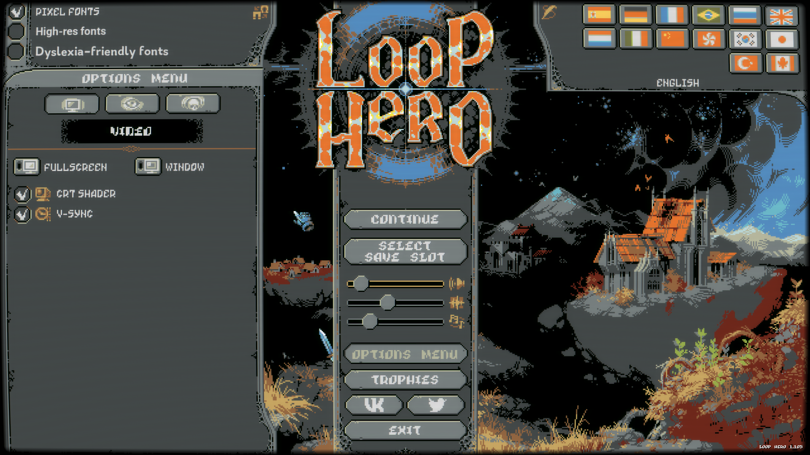
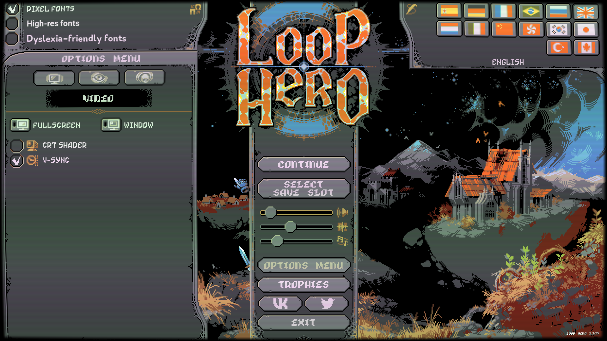
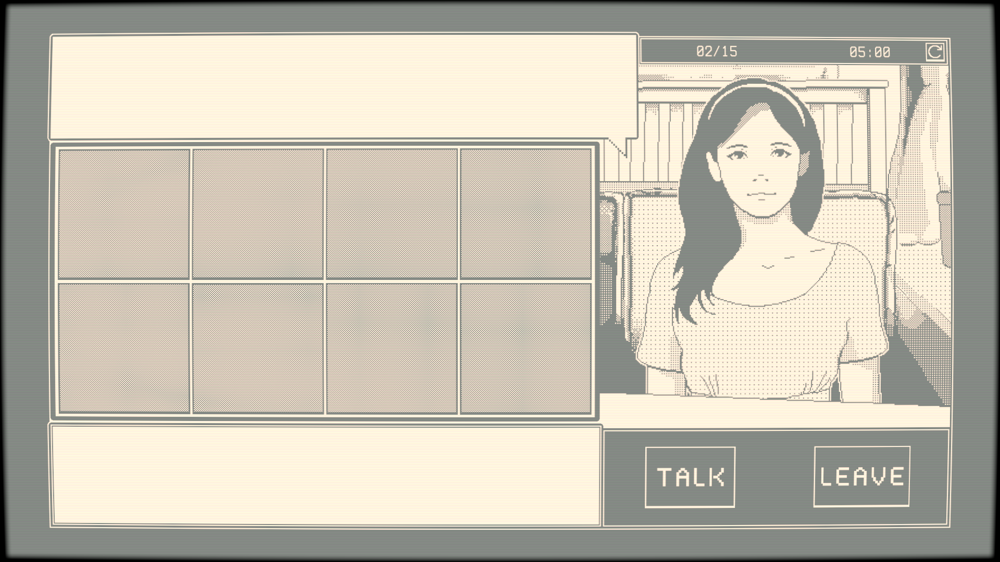

# CRT Shader

A study of Loop Hero's CRT shader, implemented as a Unity post processing effect.

## Examples

Original Loop Hero Screenshot:

My implementation:

Applied to [The Dating Game](https://github.com/GarrettGunnell/The-Dating-Game):

